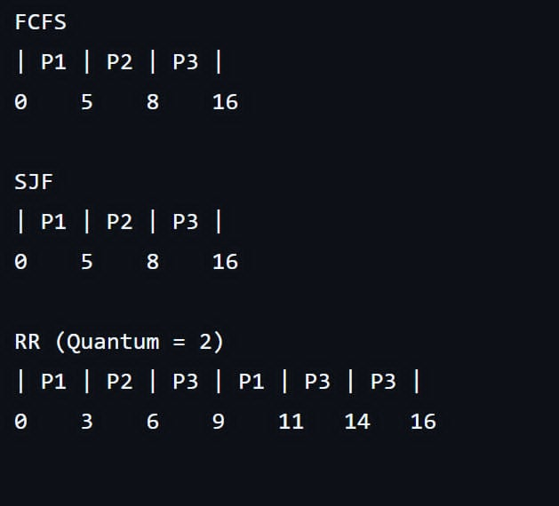

 CPU Scheduling Algorithms — OS Project

This project is written in C++ and demonstrates the implementation of CPU scheduling algorithms.
1.FCFS (First Come First Serve)
2.SJF (Shortest Job First — Non-preemptive)
3.RR (Round Robin)

Each algorithm computes Completion Time (CT), Turnaround Time (TAT = CT – AT), Waiting Time (WT = TAT – BT)
and displaysI nput and Output Tables, Average TAT and WT and a clean, text-based Gantt Chart.

Algorithm Explanations:

FCFS (First Come, First Serve)
The First Come, First Serve (FCFS) algorithm executes processes in the order they arrive.
The first process to arrive is executed first and runs until completion.
It is simple to implement but can lead to high waiting times if an early process has a long burst time.

SJF (Shortest Job First — Non-Preemptive)
The Shortest Job First (SJF) algorithm selects the process with the shortest burst time among the available processes.
Once a process starts executing, it runs until it completes.
It provides a lower average waiting time but requires knowledge of the burst times beforehand.

RR (Round Robin)
The Round Robin (RR) algorithm assigns each process a fixed time quantum (e.g., 2 or 3 units).
Each process executes for at most one quantum before moving to the back of the ready queue if unfinished.
This ensures fair CPU sharing among processes and reduces starvation.

CPU Scheduling Outputs

 FCFS (First Come, First Serve)
Command: `output/fcfs.exe`

  

---

 SJF (Shortest Job First – Non-Preemptive)
Command: `output/sjf.exe`

  

---

 Round Robin (RR)
Command: `output/rr.exe`

  

Grant Charts:

  

